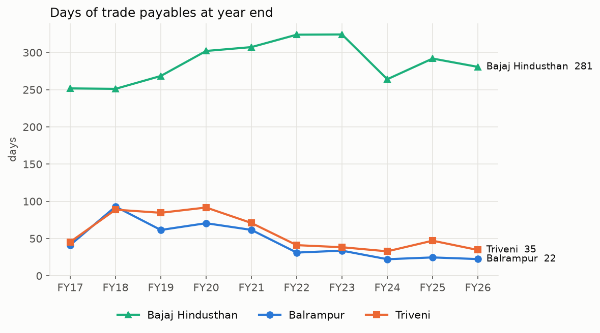
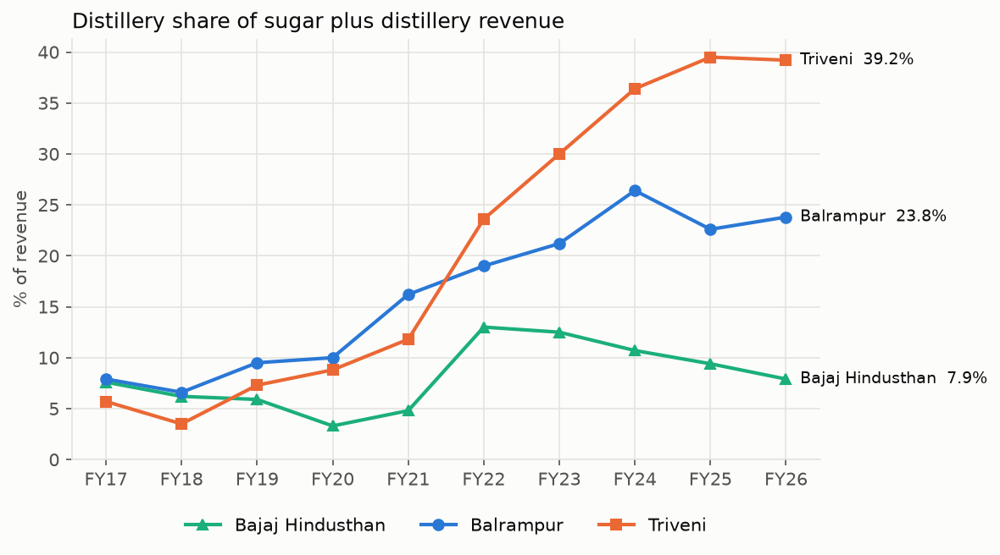
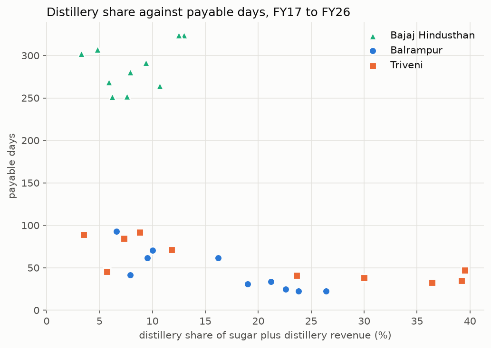
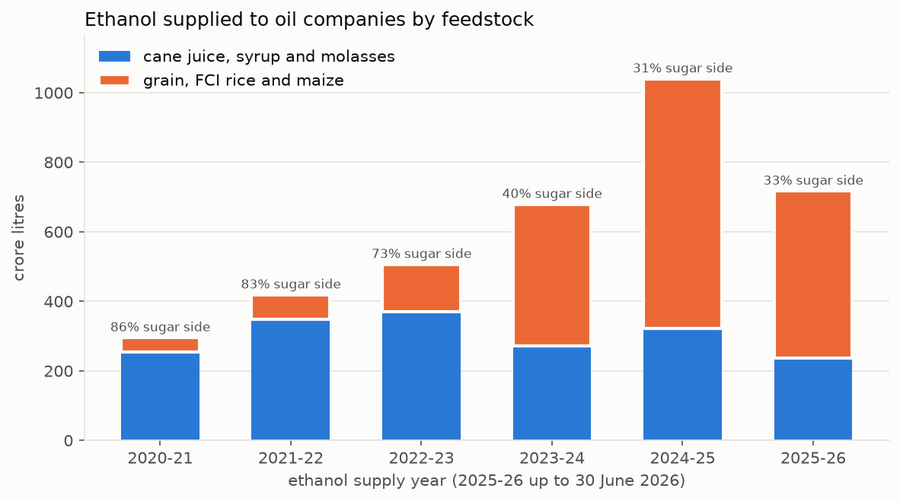

# Indian sugar case study

The Government of India often says that letting sugar mills turn surplus sugar into ethanol has helped them pay cane farmers on time. I wanted to check that claim against the official numbers, so I looked at it from two sides, the state-wise cane dues that the government reports to Parliament, and the accounts of three big private sugar companies in Uttar Pradesh.

## The three companies

I picked Balrampur Chini, Triveni Engineering and Bajaj Hindusthan Sugar because they are the three largest private sugar companies by crushing capacity, and all three crush cane in UP. That matters, because they all pay the same state cane price, so the differences between them come down to how each company runs its business.

None of them show cane dues as a separate line in the balance sheet, the dues sit inside trade payables. So I used payable days, which is trade payables at 31 March divided by the year's cost of materials (mostly cane), times 365. A company that pays farmers slowly shows a lot more payable days.

Balrampur and Triveni both built up their distilleries after 2018, and over the same years their payable days fell from around three months to three to five weeks. Bajaj Hindusthan never grew its distillery much past a tenth of its sugar and distillery revenue, and it has carried 250 to 320 days of payables for the whole decade. Two Lok Sabha answers, from September 2020 and August 2024, also named several of its mills for unpaid cane dues.

Inside Balrampur and Triveni, distillery share and payable days move strongly in opposite directions (correlation of about -0.8 for both). For Bajaj there is no such pattern.

## The national picture

The government reports state-wise dues as snapshots on different dates, and dues for a season keep shrinking as mills pay. So I only compared July snapshots, taken right after crushing ends. By mid July 2023 about 91.6% of that season's dues had been paid across India, but only 83.4% in UP. By the end of July 2024 it was 95.3% across India and 90.4% in UP. UP has been the slow payer in every snapshot I could find.

The ethanol side has changed a lot in the last few years. In 2020-21 about 86% of the ethanol supplied to the oil companies came from cane juice, syrup and molasses. By 2024-25 that was down to 31%, as maize took over, and the price paid for cane juice ethanol has stayed at Rs 65.61 a litre since 2022-23. So the channel that helped mills like Balrampur and Triveni pay faster is under more pressure now than it was when they built it.

## Limits

- Ten years for each company is enough to describe what happened, not to prove ethanol caused it. Other things changed in the same years too, like the minimum selling price of sugar, export permissions and Bajaj Hindusthan's debt restructuring.
- Payable days uses all trade payables, not only money owed to cane farmers. For sugar companies cane is most of it, but not all.
- Triveni also sells potable liquor, so its distillery revenue includes excise duty and its share looks a bit higher than the ethanol part alone.
- Bajaj Hindusthan's standalone report has no segment table, so I took its segment revenue from the consolidated notes. Its subsidiaries are not sugar businesses, so the numbers barely differ.
- State-wise July tables only exist for 2019, 2023 and 2024. For other years the Parliament answers only give national totals.
- The ethanol supply year runs roughly November to October and the sugar season October to September, so I treat them as matching, which is close but not exact.

## Files

- `state_dues.ipynb` builds `data/clean/state_dues.csv` from the July snapshots
- `ethanol.ipynb` builds `data/clean/ethanol.csv` from the ethanol supply and sugar diversion answers
- `firms.ipynb` builds `data/clean/firms.csv` with payable days and distillery share for the three companies
- `charts.ipynb` makes the charts in `charts/`

Some sources were scans or images, so I typed those tables by hand into the files ending in `_typed.csv` in `data/raw`, and checked each one against its printed totals. The company figures are typed from the annual reports, and `data/raw/firm_sources.csv` has the link to every report along with the page each figure is on.

## Sources

All the data comes from official sources:

- Rajya Sabha and Lok Sabha answers by the Ministry of Consumer Affairs, Food and Public Distribution and the Ministry of Petroleum and Natural Gas (sansad.in)
- Press Information Bureau releases of those answers (pib.gov.in)
- Annual reports of the three companies, as filed with BSE
